Optimised Ground Weather Stations: India (Precip)

## Optimised Ground Weather Stations: India

### Overview

Gridded climate data products are majorly driven by the reading from
ground stations. In that effect the number and spatial coverage of these
stations are quite important. Most of the climate data products on India
are based on limited number of ground stations, constraining to capture
the spatial variations of climate.For instance, The Global Human Climate
Network (GHCN) maintained by the National Oceanographic Association of
America (NOAA) at NASA or University of Delaware Precipitation
Climatology. The raw data for all these data sets are sourced from the
IMD but rely on far fewer weather stations; for instance, NOAA procures
data for only 45 temperature and around 300 precipitations stations
across India. This is more subtle, given India is a climatically diverse
country with the third highest number of climate zones (16 Köppen
classification)
globally.

### India: Climate Heterogeneity

Following analysis with IMD was dedicated to optimise number of ground
weather stations. The fields include monthly and maximum rainfall in 24
hours across all months. The stations location have been geo-coded and
stnadardized. The following charts are based on
the

### Implications: IMD vs Delaware (GHCN)

### Stations since 1950

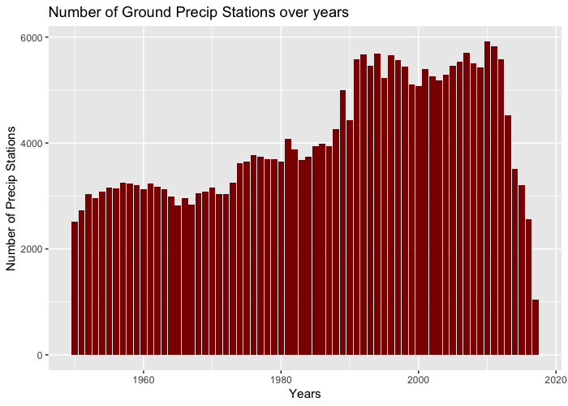

As it can seen the number of stations over the past 60 years, have been
more than avg of 3-4 thousand in number. However, some of these stations
are dropped over time or are discarded due to faulty reading. From the
perspective of analyses, following charts shows the consistent stations
across time, or in other worlds a balanced panel of
stations.

### Balanced Panel Stations

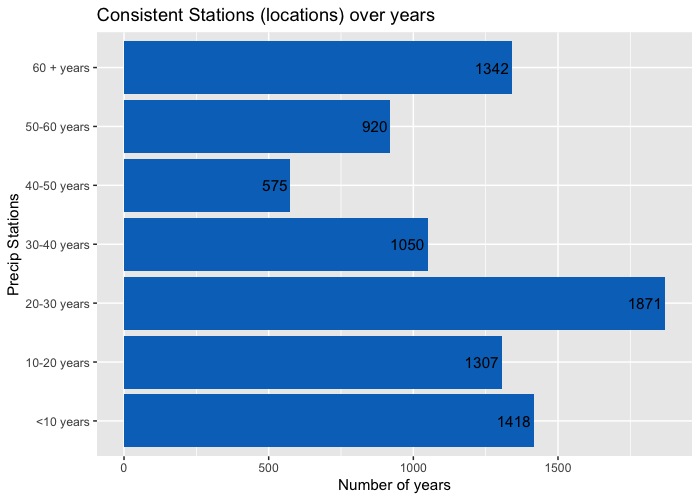

### Spatial Spread of Stations

    ## Warning: Removed 20 rows containing missing values (geom_point).

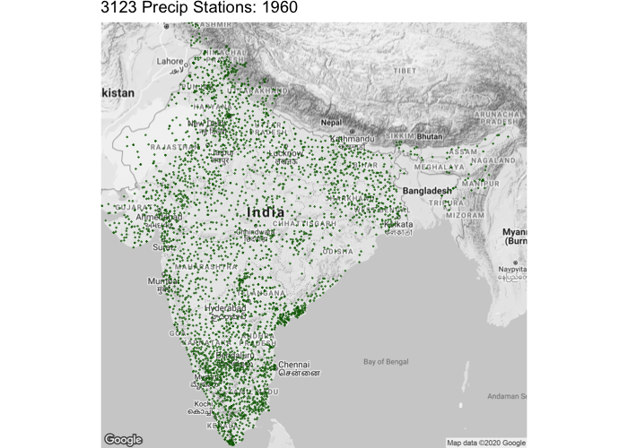

    ## Warning: Removed 5 rows containing missing values (geom_point).

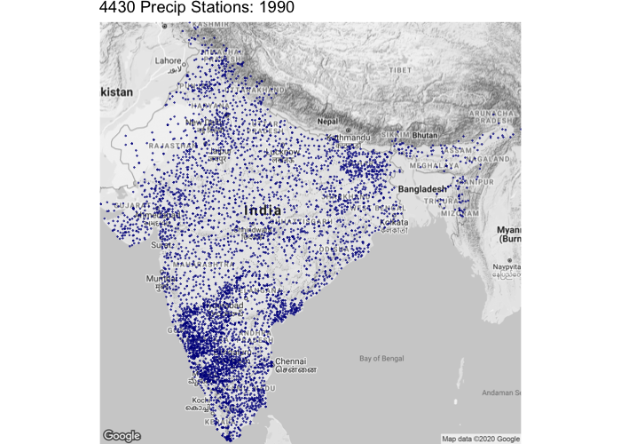

    ## Warning: Removed 17 rows containing missing values (geom_point).

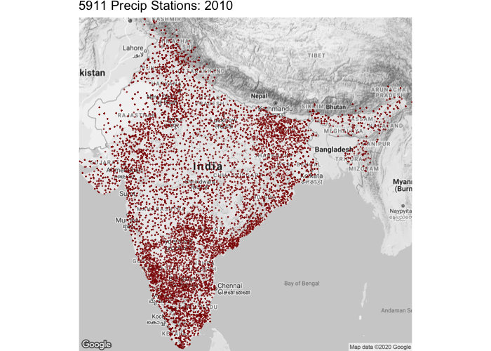

Further looking into the precipitation
    patterns

### Decadal Distrbution

    ## Warning: Removed 3693 rows containing non-finite values (stat_density).

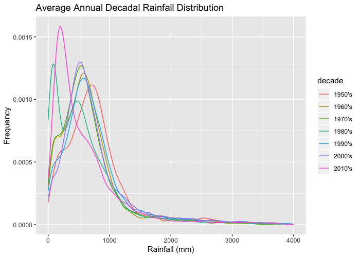

### Temperature stations since 1969

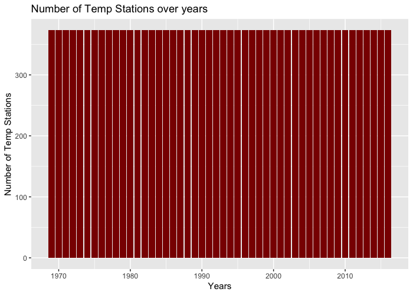

### Spatial Spread of Temperature Stations

    ## Warning: Removed 155 rows containing missing values (geom_point).

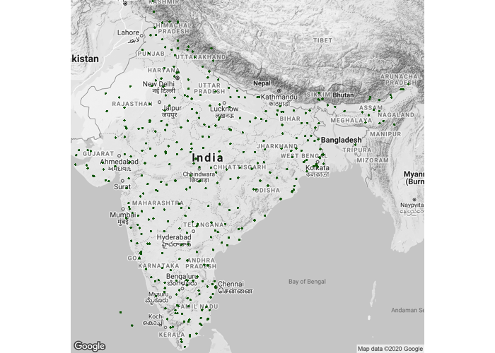

    ## Warning: Removed 155 rows containing missing values (geom_point).

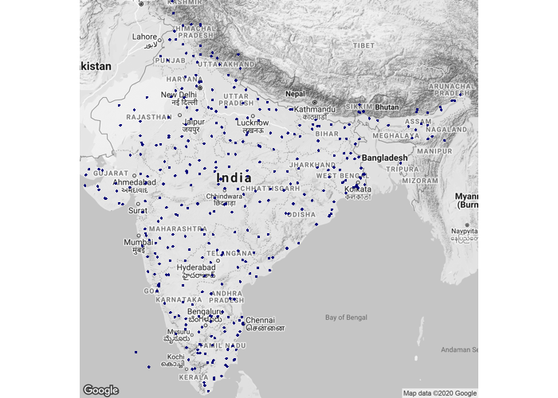

    ## Warning: Removed 155 rows containing missing values (geom_point).

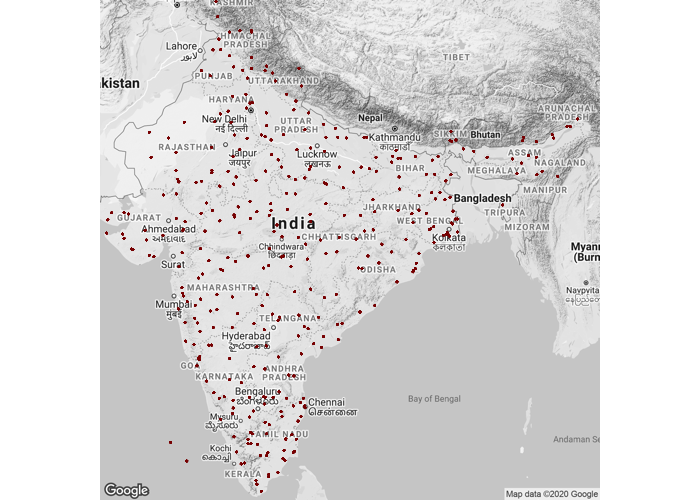

### Decadal Distrbution

    ## Warning: Removed 199197 rows containing non-finite values (stat_density).

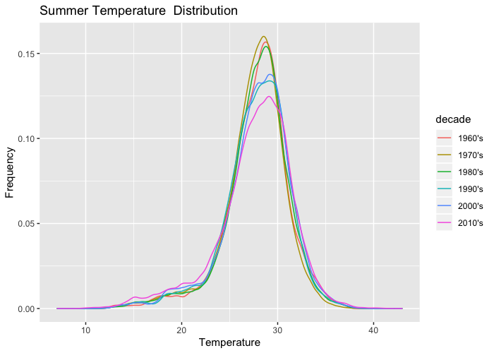

    ## Warning: Removed 202819 rows containing non-finite values (stat_density).

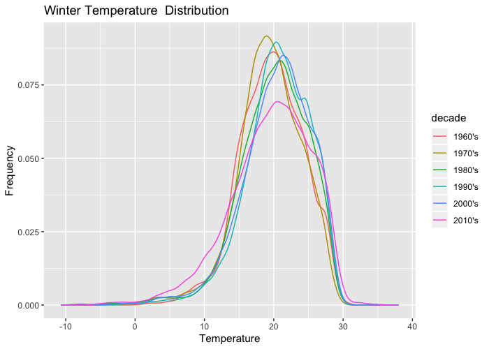

### Prior Databases Referred

